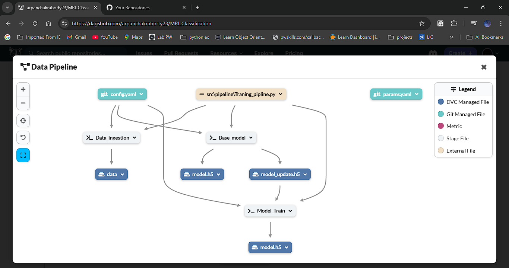

# MRI Classification using VGG-16
Project Overview
This project leverages the VGG-16 convolutional neural network (CNN) architecture to classify MRI images into various categories, such as detecting the presence of brain tumors, Alzheimer's disease, or other medical conditions based on MRI scans. The goal is to build an efficient deep learning model that can assist healthcare professionals in diagnosing conditions from medical imaging.

The project uses a pre-trained VGG-16 model as a feature extractor. VGG-16, originally trained on the ImageNet dataset, is fine-tuned on the MRI dataset to adapt the model to the specific features relevant to medical images. The model undergoes transfer learning, where the pre-trained weights are adjusted to improve classification performance for the MRI data. The project aims to develop an automated classification system that can be integrated into clinical settings to aid in quicker diagnosis and decision-making.

## Key Features:
Pre-trained Model: The VGG-16 model is pre-trained on ImageNet and used for feature extraction.
Transfer Learning: Fine-tuning of the pre-trained model to adapt it to MRI classification tasks.
High Accuracy: The use of VGG-16 ensures high classification accuracy due to its depth and performance on similar image tasks.
Medical Imaging Focus: Specific focus on MRI scans for detecting medical conditions.

## Dataset
The project uses a publicly available MRI dataset, which contains labeled MRI scans for various conditions (e.g., brain tumors, Alzheimer's disease, etc.).

### Dataset Details:
Source: [(https://universe.roboflow.com/ds/UTS3XTkOad?key=RfyjEUb2vy)]


## Data Pipline


## How to run ?

### Create Conda Env
```bash
conda create -n env python==3.11 -y
```
```
conda activate env
```

### Install Dependencis
```bash
pip install -r requirements.txt
```

### Run Web app
```bash
python app.py
```

## Work Flow
1. Data Ingestion
2. Base Model
3. Model Train
4. Model Evaluation
5. Train Pipline
6. Prediction Pipline

# AWS-CICD-Deployment-with-Github-Actions
### 1.LOgin to AWS console

### 2.Create IAN user for depolyment
```bash
# with specific access

1. EC2 access : It is virtual machine

2. ECR: Elastic Container registry to save your docker image in aws


# Description: About the deployment

1. Build docker image of the source code

2. Push your docker image to ECR

3. Launch Your EC2 

4. Pull Your image from ECR in EC2

5. Lauch your docker image in EC2

#Policy:

1. AmazonEC2ContainerRegistryFullAccess

2. AmazonEC2FullAccess
```

### 3.Create ECR repo to store/save docker image
```bash
- Save the URI: 509324781298.dkr.ecr.ap-south-1.amazonaws.com/mriclassification
```


### 4.Create EC2 machine (Ubuntu)


### 5. Open EC2 and Install docker in EC2 Machine:
```bash
#optinal

sudo apt-get update -y

sudo apt-get upgrade

#required

curl -fsSL https://get.docker.com -o get-docker.sh

sudo sh get-docker.sh

sudo usermod -aG docker ubuntu

newgrp docker
```

### 7.7. Setup github secrets:
```bash
AWS_ACCESS_KEY_ID=

AWS_SECRET_ACCESS_KEY=

AWS_REGION = ap-south-1

AWS_ECR_LOGIN_URI = demo>>  566373416292.dkr.ecr.ap-south-1.amazonaws.com

ECR_REPOSITORY_NAME = simple-app
```
